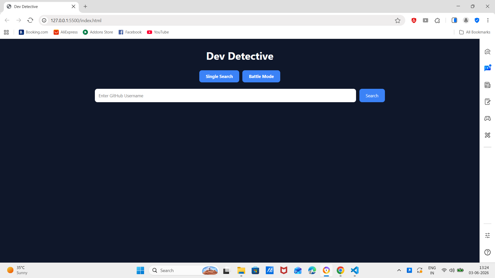
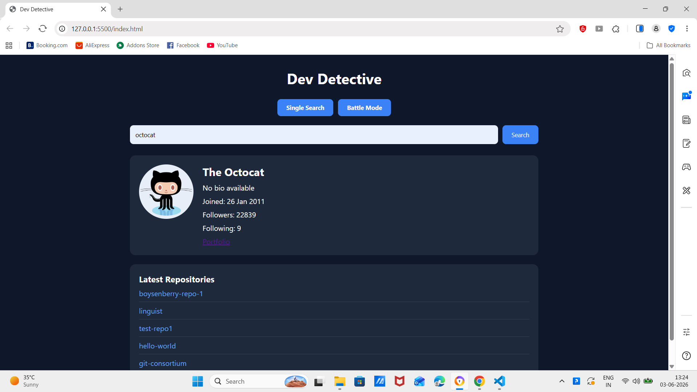
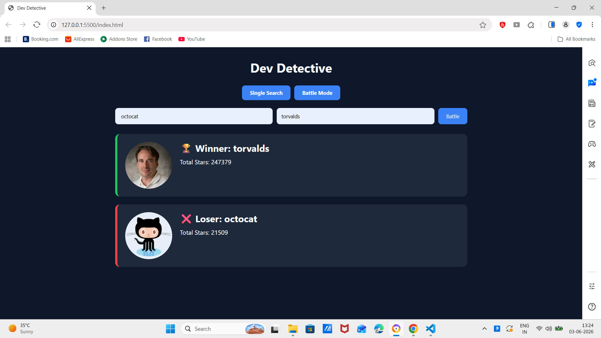

# Dev Detective 

A responsive GitHub Profile Search and Comparison application built using HTML, CSS, and JavaScript.

This project was developed for the Prodesk IT Sprint 03 assignment and demonstrates API integration, asynchronous JavaScript, DOM manipulation, and error handling using the GitHub REST API.

## Live Website

https://dev-detective-sprint03-dvrqzflo0-anushka10.vercel.app

## GitHub Repository

https://github.com/Aru-coder/dev-detective

## Features

* Search GitHub users
* Display profile information
* Loading state while fetching data
* Error handling for invalid usernames
* Latest 5 repositories display
* Human-readable date formatting
* Battle Mode for comparing two GitHub users
* Responsive design

## Screenshots

### Home Page

### Profile Search Result

### Battle Mode

## Folder Structure

github-search-app/
│
├── index.html
├── style.css
├── script.js
├── README.md
├── Prompts.md
│
└── screenshots/
├── home.png
├── profile-result.png
└── battle-mode.png

## Technologies Used

* HTML5
* CSS3
* JavaScript (ES6+)
* Fetch API
* Async/Await
* GitHub REST API

## Author

Developed by Anushka Singh

